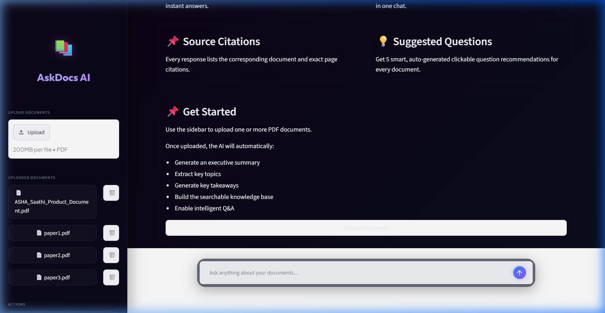
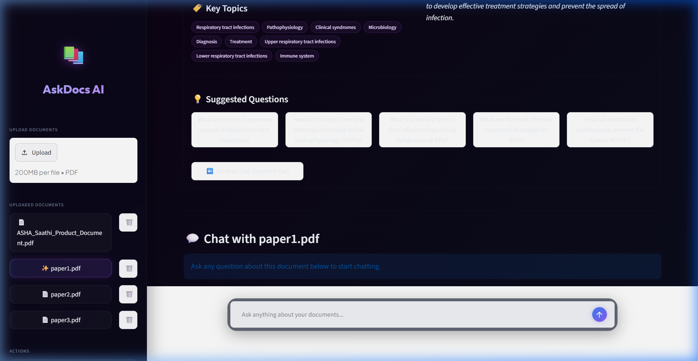
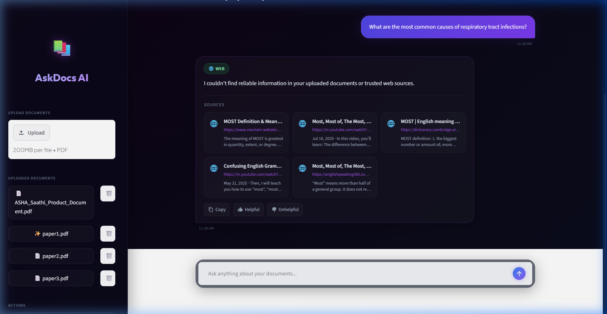
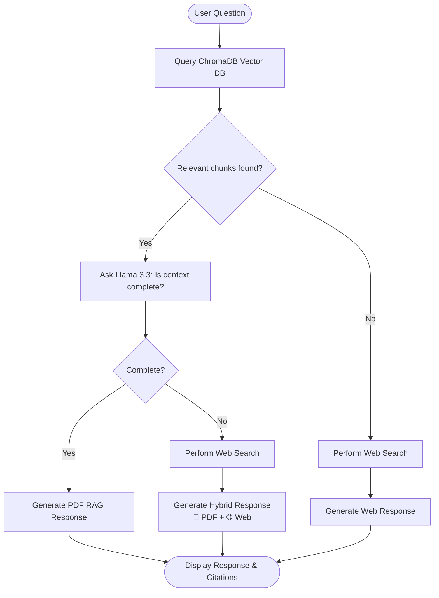

# AskDocs AI 📚🤖

An intelligent, feature-rich **Retrieval-Augmented Generation (RAG)** chatbot that allows you to upload multiple PDF documents, preview pages dynamically with interactive text highlights, and have natural conversations with source attribution. 

When answers are partially or fully unavailable in your uploaded documents, AskDocs AI automatically triggers an intelligent web search fallback to deliver a hybrid document-web response.

---

## 📸 Screenshots

### 1. Welcome Screen
*Landing page showing features and upload options before documents are selected.*


### 2. Document Insights Dashboard
*Detailed metadata metrics, executive summary, key takeaways, topics, and interactive PDF page previews with custom highlights.*


### 3. Interactive RAG Chat & Hybrid Web Search
*Conversational interface displaying answers backed by document citations (click to jump to page) and web sources.*


---

## ✨ Key Features

- **Multi-PDF Upload & Ingestion**: Drop multiple files in the sidebar and index them into a local vector store.
- **Single-Pass Insights Generation**: Automatically extracts summary, purpose, takeaways, target audience, reading difficulty, and 5 suggested questions in one prompt.
- **Cached Summaries**: Leverages a local JSON cache (`data/summaries_cache.json`) keyed by SHA-256 hashes to prevent redundant API calls.
- **Dynamic PDF Viewer with Highlights**: Page-by-page rendering of PDFs as PNGs with custom yellow highlights drawn over matching chunks retrieved by RAG.
- **Intelligent Routing**:
  - **Complete RAG**: Answers directly from document context if information is sufficient.
  - **Hybrid Answers**: Combines partial document context with web search results under distinct sections.
  - **Web Fallback**: Queries Tavily, Serper, or DuckDuckGo if no document matches.
- **Interactive Citations**: Click on document page badges in chat to open the document viewer, auto-navigate to the referenced page, and highlight the citation block.
- **Polished Theme**: Beautiful dark mode Streamlit design using glassmorphism cards, glowing background orbs, custom action buttons, copy-to-clipboard, and loading steps.

---

## 🏗️ System Architecture

The following diagram illustrates how user questions are processed, retrieved, and answered by AskDocs AI.



---

## 🛠️ Tech Stack

- **Frontend**: [Streamlit](https://streamlit.io) (augmented with [style.css](file:///c:/Users/USER/multi-doc-chatbot/style.css))
- **RAG & Orchestration**: [LangChain](https://www.langchain.com/)
- **Embeddings**: `sentence-transformers/all-mpnet-base-v2` via HuggingFace
- **Vector Database**: ChromaDB
- **LLM Engine**: Groq API (running `llama-3.3-70b-versatile`)
- **PDF Extraction & Rendering**: PyMuPDF (`fitz`), `PyPDFLoader`
- **Web Search Clients**: Tavily API, Serper API, DuckDuckGo Search

---

## 📁 Project Structure

- **[main.py](file:///c:/Users/USER/multi-doc-chatbot/main.py)**: The main entry point. Houses the Streamlit layout, document ingestion pipelines, caching, and custom JavaScript overlays.
- **[web_search.py](file:///c:/Users/USER/multi-doc-chatbot/web_search.py)**: Handles search API requests and routing logic (Tavily -> Serper -> DuckDuckGo).
- **[vectorize_documents.py](file:///c:/Users/USER/multi-doc-chatbot/vectorize_documents.py)**: CLI script to bulk index PDF documents placed inside the `data/` folder.
- **[style.css](file:///c:/Users/USER/multi-doc-chatbot/style.css)**: Custom styles defining the glassmorphic cards, typography, responsive grid columns, buttons, and ambient light orbs.
- **[config.json](file:///c:/Users/USER/multi-doc-chatbot/config.json)**: Configuration file for storing local settings and keys.

---

## 🚀 Setup & Installation

### Prerequisites
Make sure you have Python 3.10+ installed on your system.

### 1. Clone the repository and navigate to it:
```bash
git clone <repository-url>
cd multi-doc-chatbot
```

### 2. Create and activate a Virtual Environment:
```bash
# Windows
python -m venv .venv
.\.venv\Scripts\activate

# macOS / Linux
python3 -m venv .venv
source .venv/bin/activate
```

### 3. Install the dependencies:
```bash
pip install -r requirements.txt
```

### 4. Configure your API Keys:
Open **[config.json](file:///c:/Users/USER/multi-doc-chatbot/config.json)** and specify your keys:
```json
{
  "GROQ_API_KEY": "your_groq_api_key",
  "TAVILY_API_KEY": "your_tavily_key_optional",
  "SERPER_API_KEY": "your_serper_key_optional",
  "SIMILARITY_THRESHOLD": 1.3
}
```
> **Note**: You can also set these keys as environment variables. DuckDuckGo is used as a fallback web search if no API key is set for Tavily or Serper.

### 5. Launch the Streamlit application:
```bash
streamlit run main.py
```
Open your browser and navigate to `http://localhost:8501`.

---

## 💡 Troubleshooting

### `sqlite3` Database Errors (Windows/Linux)
ChromaDB requires a newer version of SQLite3. On some systems, the default Python sqlite3 library is outdated.
AskDocs AI handles this by automatically checking and loading `pysqlite3-binary` as a fallback at startup. Make sure it is installed:
```bash
pip install pysqlite3-binary
```

---

## 👨‍💻 Author

**Sweedel Rodrigues**
